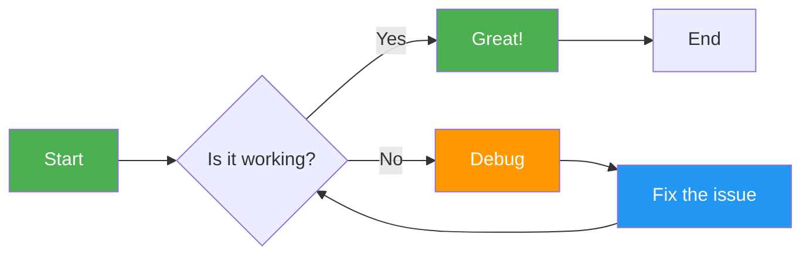
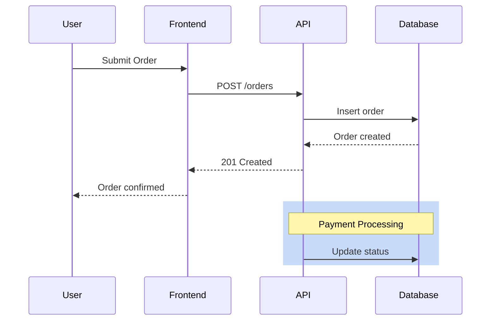
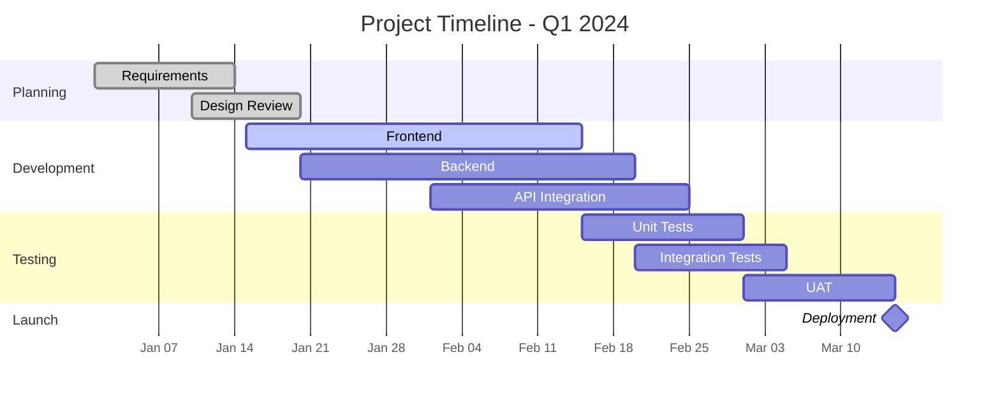
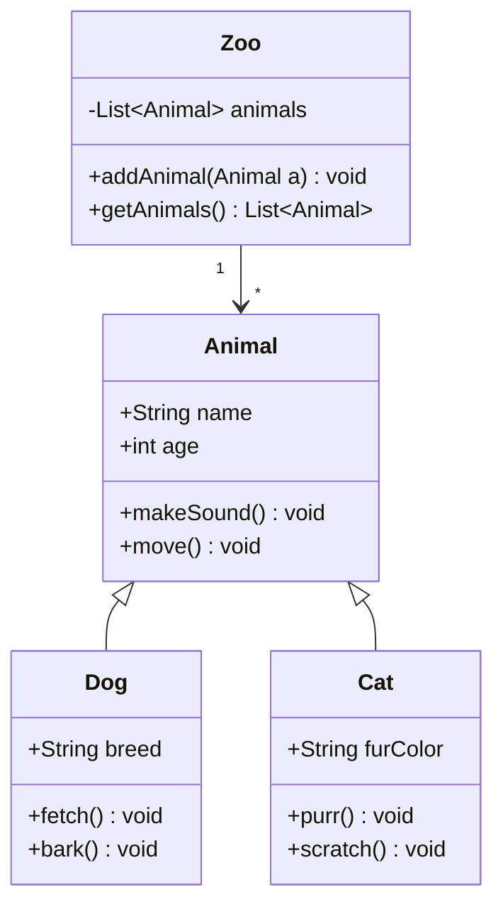
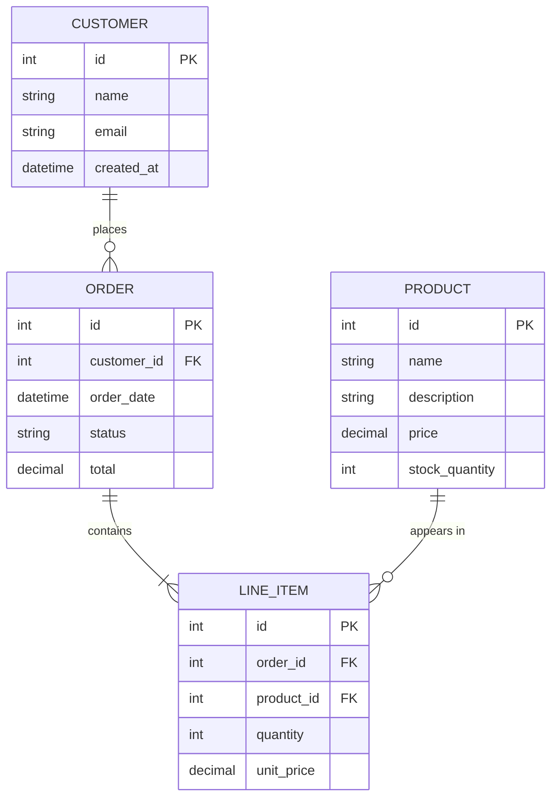
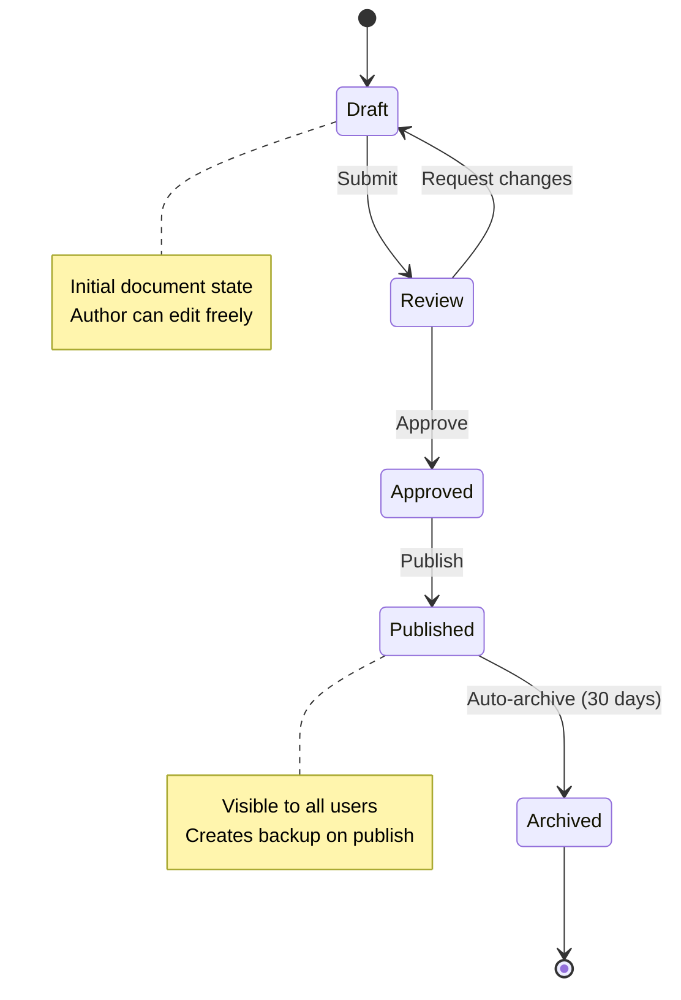
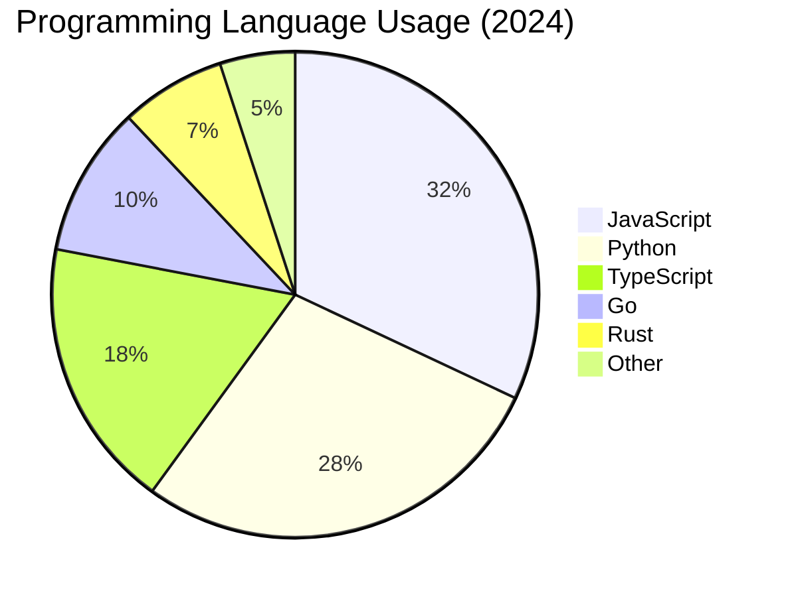
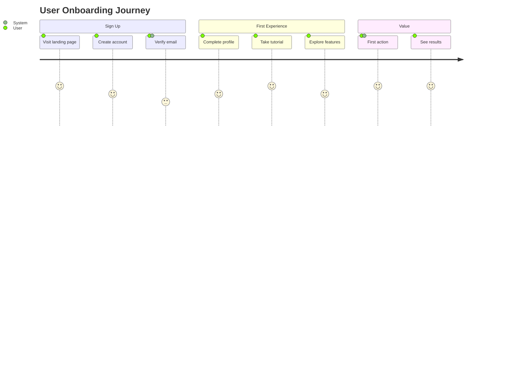
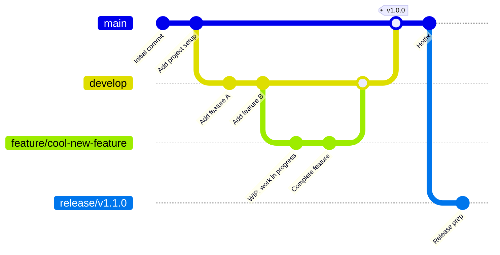

# Markdown Mastery

Write expressive, beautifully formatted markdown — from basic documents to complex technical content with diagrams, advanced formatting, and automated tooling.

## Core Principles

### 1. Markdown Is Code — Treat It With Respect
Formatting consistency matters. Lint your markdown, format it automatically, keep line lengths reasonable, and use semantic elements correctly.

### 2. Every Element Has a Purpose
Don't use bold where a heading belongs. Don't use inline code where a code block is needed. Don't use manual numbering where list numbering works. Semantic markdown is readable markdown.

### 3. Diagrams Are Documentation
A Mermaid diagram is worth a thousand words of architectural explanation. Embed diagrams directly in documentation — they version alongside the code and never go out of sync.

### 4. Write for Plain Text First
Markdown's superpower is readability in its raw form. Even without a renderer, your document should be scannable and understandable.

---

## Markdown Mastery Maturity Model

| Level | Syntax Knowledge | Formatting | Diagrams | Tooling | Complex Documents |
|-------|-----------------|------------|----------|---------|-------------------|
| **1: Basic** | Bold, italic, links, lists | Inconsistent | None | None | Single flat file |
| **2: Intermediate** | Headings, code blocks, tables | Mostly consistent | Basic flowcharts | Manual formatting | Multi-section documents |
| **3: Proficient** | Extended syntax, footnotes, task lists | Consistent style | Sequence, state diagrams | Markdown linter | Structured with TOC |
| **4: Advanced** | GFM, HTML embedding, custom containers | Linted + auto-formatted | Complex Mermaid (Gantt, class, ERD) | CI pipeline | Multi-file with includes |
| **5: Expert** | Obsidian/Notion syntax, MDX, plugins | Programmatic enforcement | Full diagram ecosystem | Custom tooling | Generated documentation portals |

**Target**: Level 3 for most developers. Level 4 for technical writers and documentation maintainers.

---

## Actionable Guidance

### Extended Markdown Syntax Reference

#### Tables

```markdown
| Feature | Basic Markdown | GFM Extended | Notes |
|---------|---------------|--------------|-------|
| Bold | `**text**` | Same | Use double asterisks |
| Italic | `*text*` | Same | Use single asterisks |
| Strikethrough | — | `~~text~~` | Not in original spec |
| Task List | — | `- [ ] task` | GFM only |
| Tables | — | `\| col \| col \|` | GFM only |
| Auto-link | — | `<url>` | Angle brackets |
| Fenced code blocks | — | ```` ``` ```` | With language tag |
| Emoji | — | `:smile:` | GFM renders to emoji |

**Alignment in tables:**

```markdown
| Left aligned | Center aligned | Right aligned |
|:-------------|:--------------:|--------------:|
| Left         | Center         | Right         |
| Default      | `:---:`        | `---:`        |
```

#### Footnotes

```markdown
Here's a statement that needs a footnote[^1].

And another reference to the same footnote[^1].

[^1]: This is the footnote content. It can span multiple lines
    if you indent the continuation lines.

    You can even have paragraphs in footnotes.

**Rendered as**: Superscript number in text, footnote content at bottom of page.
```

#### Task Lists

```markdown
## Documentation Checklist

- [x] Write the README
- [x] Add API documentation
- [ ] Create contribution guide
- [ ] Add code examples
- [ ] Verify all links work
- [ ] Get peer review

## Status Key
- `[x]` = Complete
- `[ ]` = Not started
- `[-]` = In progress (use `~~[ ]~~` or custom indicator)
```

#### Definition Lists

```markdown
While not part of standard markdown, definition lists work in many renderers:

Markdown
: A lightweight markup language for formatting plain text.

GFM
: GitHub Flavored Markdown — the extended syntax used on GitHub.

Mermaid
: A JavaScript-based diagramming and charting tool that renders Markdown-inspired text definitions.
```

#### Subscript and Superscript

```markdown
H~2~O is water.         <!-- Subscript with ~ -->
X^2^ is X squared.     <!-- Superscript with ^ -->
CO~2~ emissions        <!-- Carbon dioxide -->

Note: These work in some renderers but not GFM.
In GFM, use HTML: H<sub>2</sub>O or X<sup>2</sup>
```

#### Highlight and Keyboard Tags

```markdown
==This text is highlighted== in some renderers.

Press <kbd>Ctrl</kbd> + <kbd>C</kbd> to copy.
Press <kbd>⌘</kbd> + <kbd>Shift</kbd> + <kbd>P</kbd> to open command palette.
```

---

### Mermaid Diagrams

Mermaid lets you create diagrams using text definitions that render inline in markdown. Diagrams are version-controlled alongside your code.

#### Setup

```bash
# Mermaid CLI (for rendering locally)
npm install -g @mermaid-js/mermaid-cli

# Render a mermaid file
npx mmdc -i diagram.mmd -o diagram.png

# VS Code extension: "Markdown Preview Mermaid Support"
# GitHub: Mermaid supported natively in Markdown files
# GitLab: Mermaid supported in Markdown blocks
# Notion: Mermaid support via `/mermaid` command
```

#### Flowcharts

```markdown


**Syntax:**

```text
flowchart <orientation>
  <node_id>[<label>] --> <node_id>{<label>}

Orientations: LR (left-right), RL (right-left), 
              TB (top-bottom), BT (bottom-top)

Node shapes:
  [text]    - Rectangle
  (text)    - Rounded rectangle
  {text}    - Diamond (decision)
  [[text]]  - Subroutine
  >text]    - Asymmetric
  (((text))) - Double circle
```

#### Sequence Diagrams

```markdown


**Syntax:**

```text
sequenceDiagram
    participant <name>
    actor <name>       - Person icon
    
    <actor>->><actor>: Solid line (request)
    <actor--><actor>: Dashed line (response)
    
    Note over <actor>,<actor>: <text>
    rect rgb(r, g, b)
        ... group ...
    end
```

#### Gantt Charts

```markdown


**Status indicators:**
- `done` — Completed (filled bar)
- `active` — In progress (hatched bar)
- `crit` — Critical path (red border)
- `milestone` — Single-day milestone (diamond)
- Default — Planned (empty bar)

#### Class Diagrams

```markdown


**Visibility modifiers:**
- `+` Public
- `-` Private
- `#` Protected
- `~` Package/Internal

#### Entity-Relationship Diagrams (ERD)

```markdown


**Relationship cardinality:**
- `||--||` : One-to-one
- `||--o{` : One-to-many (optional)
- `||--|{` : One-to-many (required)
- `}o--o{` : Many-to-many (optional)
- `}|--|{` : Many-to-many (required)

#### State Diagrams

```markdown


#### Pie Charts

```markdown


#### User Journey Maps

```markdown


#### Git Graph

```markdown


---

### GitHub-Flavored Markdown (GFM) Specifics

#### Mentioning Users and Teams

```markdown
@username — Mentions a user
@org/team-name — Mentions a team (notifies all members)

<!-- Examples -->
@octocat Can you review this PR?
@acme/security-team Please review the security implications.
```

#### Issue and PR References

```markdown
#123        — Links to issue/PR #123
org/repo#456 — Cross-repo reference
GH-789      — Also works in some contexts

<!-- In commit messages -->
Closes #123
Fixes #456
Resolves #789
See also: #234

<!-- In PR descriptions -->
**Related issues**: #123, #456
**Depends on**: #789
```

#### Autolinked References

```markdown
<!-- URLs are auto-linked -->
https://example.com

<!-- SHA references link to commits -->
```bash
git log --oneline
```
<!-- The commit SHA `abc1234` is auto-linked -->

<!-- Markdown references -->
[Documentation](https://docs.example.com)
```

#### Emoji Support

```markdown
:rocket: — 🚀
:bug: — 🐛
:sparkles: — ✨
:fire: — 🔥
:white_check_mark: — ✅
:x: — ❌
:warning: — ⚠️
:book: — 📖
:hammer_and_wrench: — 🛠️
:chart_with_upwards_trend: — 📈
:package: — 📦
:lock: — 🔒

<!-- Common in commit messages -->
:tada: Initial commit
:sparkles: New feature
:bug: Fix bug
:recycle: Refactor
:zap: Performance improvement
:memo: Documentation
:white_check_mark: Add tests
:green_heart: Fix CI
```

#### Alerts (GitHub 2024+)

```markdown
> [!NOTE]
> Useful information that users should know, even when skimming.

> [!TIP]
> Helpful advice for doing things better or more easily.

> [!IMPORTANT]
> Key information users need to know to achieve their goal.

> [!WARNING]
> Urgent info that needs immediate user attention to avoid problems.

> [!CAUTION]
> Advises about risks or negative outcomes of certain actions.
```

#### Collapsible Sections

```markdown
<details>
<summary>Click to expand — Troubleshooting Steps</summary>

1. Check the logs at `/var/log/app.log`
2. Verify the configuration file exists
3. Restart the service: `systemctl restart app`
4. If still failing, contact support

```bash
journalctl -u app.service -n 50
```
</details>
```

#### Diff Blocks

```markdown
```diff
# Show changes like a diff
- console.log("Hello World");
+ console.log("Hello, Markdown Mastery!");
```

In GFM, diff blocks with `+` (green) and `-` (red) lines visually highlight changes.
```

---

### Markdown Linting and Auto-Formatting

#### Markdownlint Configuration

```json
{
  "MD001": true,
  "MD003": { "style": "atx" },
  "MD004": { "style": "dash" },
  "MD007": { "indent": 2 },
  "MD009": { "br_spaces": 2 },
  "MD012": true,
  "MD013": { "line_length": 80, "code_blocks": false },
  "MD014": true,
  "MD018": true,
  "MD019": true,
  "MD022": true,
  "MD024": { "allow_different_nesting": true },
  "MD025": true,
  "MD026": { "punctuation": ".,;:!" },
  "MD027": true,
  "MD028": true,
  "MD029": { "style": "one" },
  "MD030": true,
  "MD031": true,
  "MD032": true,
  "MD033": { "allowed_elements": ["details", "summary", "kbd", "sub", "sup"] },
  "MD034": true,
  "MD035": { "style": "---" },
  "MD036": false,
  "MD037": true,
  "MD038": true,
  "MD039": true,
  "MD040": true,
  "MD041": true,
  "MD042": true,
  "MD043": false,
  "MD044": { "names": ["Markdown", "GitHub", "JavaScript", "TypeScript", "VS Code"] },
  "MD045": false,
  "MD046": { "style": "fenced" },
  "MD047": true,
  "MD048": { "style": "backtick" }
}
```

#### Running Linters

```bash
# Install markdownlint
npm install -g markdownlint-cli2

# Check all markdown files
npx markdownlint-cli2 'docs/**/*.md' '#node_modules'

# Auto-fix what you can
npx markdownlint-cli2 --fix 'docs/**/*.md'

# With custom config
npx markdownlint-cli2 \
  --config .markdownlint.json \
  'docs/**/*.md'
```

#### Prettier for Markdown

```json
{
  "semi": false,
  "singleQuote": true,
  "tabWidth": 2,
  "trailingComma": "all",
  "printWidth": 80,
  "proseWrap": "always",
  "overrides": [
    {
      "files": "*.md",
      "options": {
        "parser": "markdown",
        "proseWrap": "always",
        "printWidth": 80
      }
    }
  ]
}
```

```bash
# Format all markdown files
npx prettier --write '**/*.md'

# Check without writing
npx prettier --check '**/*.md'

# Format in CI
npx prettier --check 'docs/**/*.md' || echo "Run 'npx prettier --write' to fix"
```

#### CI Pipeline for Markdown Quality

```yaml
# .github/workflows/markdown-quality.yml
name: Markdown Quality
on:
  pull_request:
    paths:
      - '**/*.md'

jobs:
  lint:
    runs-on: ubuntu-latest
    steps:
      - uses: actions/checkout@v3
      
      - name: Markdown Lint
        run: |
          npx markdownlint-cli2 '**/*.md' \
            '#node_modules' \
            --config .markdownlint.json
      
      - name: Format Check
        run: |
          npx prettier --check '**/*.md'
      
      - name: Spell Check
        uses: streetsidesoftware/cspell-action@v2
        with:
          files: '**/*.md'
      
      - name: Validate Mermaid Diagrams
        run: |
          # Extract mermaid blocks and validate syntax
          for file in $(find docs -name "*.md"); do
            echo "Checking $file for mermaid syntax..."
            # Use mermaid CLI to render and check for errors
          done
```

---

### Documentation Generators from Markdown

#### Static Site Generators

```bash
# Vitepress (Vue-based)
npm create vitepress my-docs
cd my-docs
npm run docs:dev

# Docusaurus (React-based)
npx create-docusaurus@latest my-docs classic

# MkDocs (Python-based)
pip install mkdocs mkdocs-material
mkdocs new my-docs

# Hugo (Go-based)
hugo new site my-docs
```

#### Generating Tables of Contents

```markdown
<!-- Manual TOC (update when structure changes) -->
## Table of Contents
- [Introduction](#introduction)
- [Getting Started](#getting-started)
- [Configuration](#configuration)
- [API Reference](#api-reference)
- [Troubleshooting](#troubleshooting)

<!-- Or use a TOC generator plugin -->
<!-- VS Code: "Markdown All in One" extension → Right-click → TOC -->
```

```bash
# Generate TOC using doctoc
npx doctoc docs/my-file.md

# Or using markdown-toc
npx markdown-toc docs/my-file.md
```

#### Converting Markdown to Other Formats

```bash
# Markdown → HTML
npx marked README.md -o README.html

# Markdown → PDF
npx md-to-pdf README.md

# Markdown → DOCX (Word)
pandoc README.md -o README.docx

# Markdown → LaTeX → PDF
pandoc README.md -o README.pdf --pdf-engine=xelatex

# Markdown → slides
npx marp README.md -o slides.html
npx marp README.md -o slides.pdf
```

---

### Embedding HTML in Markdown

Markdown renders HTML inline. Use this when markdown syntax is insufficient:

```html
<!-- Custom containers -->
<div class="warning">
  <h3>⚠️ Important Security Notice</h3>
  <p>Never commit API keys or secrets. Use environment variables
  or a secrets manager instead.</p>
</div>

<!-- Image sizing -->


<!-- Iframes for embedded content -->
<iframe 
  src="https://codesandbox.io/embed/example" 
  width="100%" 
  height="500"
  title="Interactive example"
></iframe>

<!-- Video embeds -->
<video controls width="800">
  <source src="demo.mp4" type="video/mp4">
  Your browser does not support the video tag.
</video>

<!-- YouTube embed -->
<iframe 
  width="560" 
  height="315" 
  src="https://www.youtube.com/embed/dQw4w9WgXcQ" 
  title="YouTube video"
  frameborder="0" 
  allowfullscreen
></iframe>

<!-- Custom lists with icons -->
<ul class="feature-list">
  <li>✅ Fast performance</li>
  <li>🔒 Secure by default</li>
  <li>🌐 Cross-platform</li>
</ul>
```

**Best Practices:**
- Use HTML only when markdown doesn't support the feature
- Keep HTML minimal — don't recreate layouts
- Test in your target renderer (GitHub strips some HTML)
- Use markdown inside HTML blocks where possible

---

### Platform-Specific Syntax

#### Obsidian

```markdown
---
aliases: [alt-name, another-name]
tags: [markdown, obsidian]
created: 2024-01-15
---

# Obsidian Features

## Internal Links
[[My Other Note]]           — Link to another note
[[My Note|Display Text]]    — Link with custom display text

## Embeds
![[image.png]]              — Embed an image
![[note.md]]                — Embed contents of another note

## Tags
#tag                       — Inline tag
#project/active            — Nested tag

## Block References
This is a paragraph. ^block-id
See [[Note#^block-id]]     — Reference a specific block

## Callouts
> [!note] Title
> Content of the callout

> [!abstract] Summary
> Key takeaways

> [!info] Information
> Additional context

> [!danger] Danger
> Critical warning
```

#### Notion

```markdown
<!-- Notion Markdown import/export specifics -->

# Heading 1    → Toggle heading in Notion
## Heading 2   → Normal heading 2
### Heading 3  → Normal heading 3

- [x] Task list → Notion checkboxes (synced)
- [ ] Task     → Unchecked checkbox

<!-- Code blocks import as Notion code blocks -->
```python
print("Hello Notion")
```

<!-- Tables import as Notion databases (not markdown tables) -->
| Name | Type |
|------|------|
| Item | Note |

<!-- Notion-specific: -->
<!-- /command → Slash commands in Notion -->
<!-- @date → Date mentions -->
<!-- @person → Person mentions -->
```

#### MDX (Markdown + JSX)

```mdx
export const Highlight = ({children, color}) => (
  <span style={{backgroundColor: color, padding: '0.2em'}}>
    {children}
  </span>
);

# MDX Example

You can use JSX in markdown with MDX!

<Highlight color="#ff0">
  This text is highlighted in yellow.
</Highlight>

{2 + 2}  {/* → renders as 4 */}

import CodeBlock from '@theme/CodeBlock';

<CodeBlock language="python">
{`print("Hello from MDX!")`}
</CodeBlock>

export const toc = [
  {value: 'Introduction', id: 'introduction', level: 2},
  {value: 'Usage', id: 'usage', level: 2},
];
```

---

### Advanced Formatting Patterns

#### Multi-Language Code Tabs

```markdown
<!-- Docusaurus/MkDocs Material code tabs -->

=== "Python"
    ```python
    def hello():
        print("Hello, World!")
    ```

=== "JavaScript"
    ```javascript
    function hello() {
        console.log("Hello, World!");
    }
    ```

=== "Go"
    ```go
    func hello() {
        fmt.Println("Hello, World!")
    }
    ```

=== "Rust"
    ```rust
    fn hello() {
        println!("Hello, World!");
    }
    ```
```

#### Admonitions (Docusaurus)

```markdown
:::note[My Custom Title]
Some **content** with markdown syntax.
:::

:::tip
Best practice recommendation here.
:::

:::info
Additional context or background information.
:::

:::warning
Be careful with this configuration.
:::

:::danger
Do not do this in production!
:::
```

#### Image with Caption

```markdown
<figure>
  
  <figcaption>
    <strong>Figure 1:</strong> System architecture showing the 
    microservices and their communication patterns.
  </figcaption>
</figure>
```

#### Mathematical Expressions (LaTeX)

```markdown
<!-- Inline math: $E = mc^2$ -->

<!-- Display math:
$$
\frac{-b \pm \sqrt{b^2 - 4ac}}{2a}
$$
-->

<!-- GitHub supports LaTeX with $$ delimiters -->
$$
O(n \log n)
$$

$$
\hat{y} = \sigma(W \cdot x + b)
$$
```

---

## Common Mistakes

1. **Inconsistent heading hierarchy**: Jumping from `# Title` to `### Sub-section` without a `##` in between breaks document structure and accessibility.

2. **Misusing bold for headings**: If it's a section title, use a heading (`##`), not bold (`**`). Headings enable navigation, table of contents, and accessibility.

3. **Broken table formatting**: Tables with misaligned dashes or missing pipes break entirely. Use a markdown table formatter.

4. **Code blocks without language tags**: A code block without a language tag won't get syntax highlighting. Always specify the language: <code>\`\`\`python</code>.

5. **Wrapping inline code**: Inline code should be on one line. Multi-line content needs a fenced code block.

6. **Too many Mermaid diagrams**: Diagrams are great but rendering complex diagrams on every page load impacts performance. Use them judiciously.

7. **Inconsistent list indentation**: Mixed spaces and tabs in nested lists cause rendering issues. Use exactly 2 or 4 spaces for sub-lists.

8. **Trailing whitespace**: Two spaces at the end of a line creates a line break in markdown. Unintentional trailing whitespace causes invisible line breaks.

9. **Not linting markdown**: Inconsistent formatting makes documents harder to read and maintain. Lint and format automatically.

10. **Unclosed HTML tags**: When embedding HTML in markdown, make sure all tags are properly closed or rendering breaks silently.

---

## Evaluation Rubric

| Criterion | 1 - Basic | 2 - Proficient | 3 - Advanced | 4 - Expert |
|-----------|-----------|----------------|---------------|-------------|
| **Syntax Knowledge** | Bold, italic, links, lists | Headings, code, tables, images | Footnotes, task lists, def lists | HTML embed, MDX, custom |
| **Diagrams** | None | Basic flowcharts | Sequence, state, class diagrams | ERD, Gantt, git graph, journey |
| **Formatting Consistency** | Inconsistent | Mostly consistent | Linted + formatted | Programmatic enforcement |
| **Tooling** | Manual editing | Basic linter | Linter + prettier in CI | Full pipeline with validation |
| **Platform Knowledge** | One platform | GFM specifics | GFM + one other (Obsidian/Notion) | All major platforms |
| **Document Structure** | Single flat file | Multiple sections with TOC | Multi-file with includes | Generated documentation portal |
